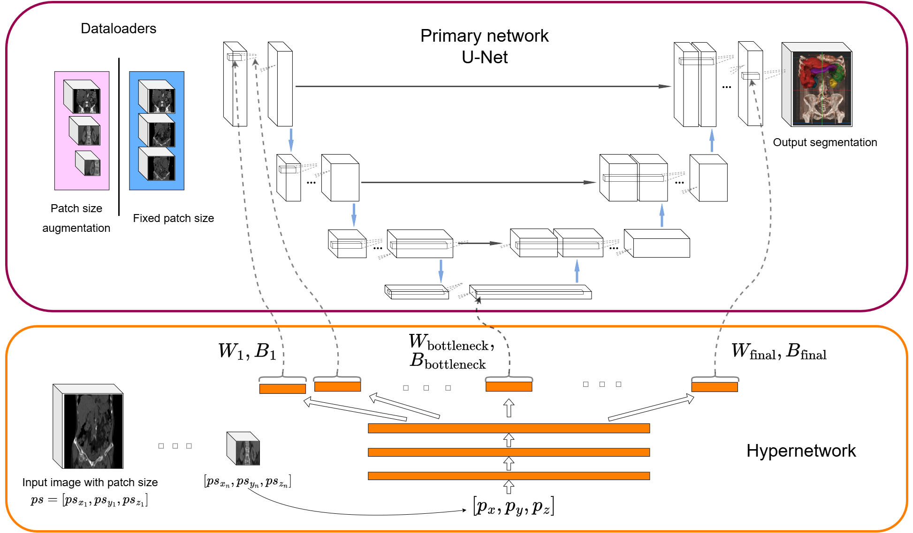

# Why is patch size important?
Code for the MIDL 2025 paper "Why is patch size important? Dealing with context variability in segmentation networks"

# Overview
In this repository, we propose two solutions that address the distribution shift in contextual information that arises when using different patch sizes at inference time compared to training. Using a different patch size, specially a smaller one, is a practical stategy to decrease computational load when deploying a model in resource-contrained environments like hospitals. The two proposed solutions are:

1. Patch size augmentation during training—a simple yet effective approach to improve robustness.

2. A [hypernetwork](https://arxiv.org/abs/1609.09106) conditioned on the patch size, which dynamically generates optimal weights for the primary model based on the available context. This method provides additional performance gains, with a modest increase in training complexity.



# Repository organization

This repository is composed of 5 files: 

- **data.py**: This file contains two data loaders, one for training (patched images) and another one for inference (whole images). This part of the pipeline relies on the [ImFusion Python SDK](https://docs.imfusion.com/python/) for image loading and basic preprocessing. These loaders expect data list files that specify input data files and the associated segmentation file names. Example data lists are available in the ```data_files``` folder.

- **models.py**: This file contains the model definitions, in particular the definition of a standard UNet and a conditional UNet which are the two types of architectures used in our experiments in different training or inference settings.

- **train.py**: This file contains the training and validation loops. To reproduce our training, simply run:  
    ```bash
    python train.py -c configs/config.yaml
    ```  
    Notice that the sample data files in `data_files` folder must be updated with the correct file paths.

- **eval.py**: This file contains our evaluation script which we used to compute the metrics reported in the paper.

- **utils.py**: This file contains various utility functions including the losses, image saving functionalities (relying on the [ImFusion Python SDK](https://docs.imfusion.com/python/) as well), and others.
